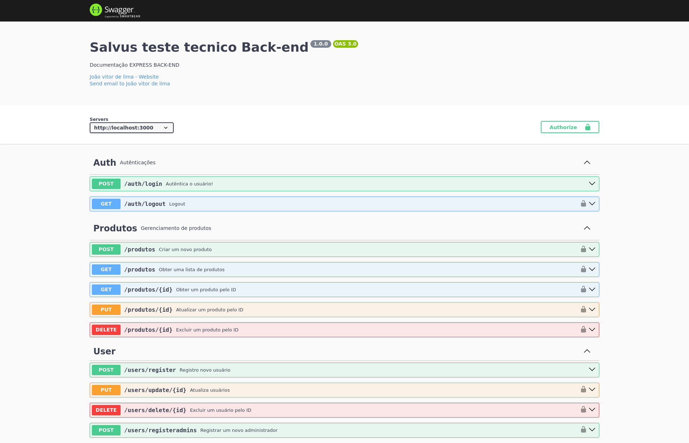

# Desafio Salvus

### Check

- [x] MVC completo
- [x] API COM NODE JS
- [x] Frontend com React.js
- [x] Integração e Deploy
- [x] Autênticação JWT, bearer token
- [x] Swagger, documentação de apis
- [x] docker embarcado
- [x] operações tipo crud


## 💻 Pré-requisitos

Antes de começar, verifique se você atendeu aos seguintes requisitos:

- Npm 10.7.0
- Node v18.20.3
- Docker version 26+

## 📜 Observações
  A porta 3000 será mapeada para o backend e a porta 5000 para o front assegure que elas estejam disponíveis, também observe se a porta 3306 está disponível para o mysql, também disponibilizei o PHPMYADMIN na porta 8081 no localhost 3000 para monitoramento do Banco de dados. Respostas ao questionário téorico no arquivo Respostas.txt

## 🚀 Instalação

```bash
# Clone este repositório
$ git clone https://github.com/JoaolimaDev/Selecao-salvus.git
# Acesse a pasta do projeto no seu terminal/cmd
$ cd Selecao-salvus
# Instalar as dependências e run docker
$ npm install,
$ npm run dev
$ npm run dev
$ sudo docker-compose up -d
# Criação do banco de desenvolvimento, migration e seeds
$ npx sequelize-cli db:create
$ npx sequelize-cli db:migrate
$ npx sequelize-cli db:seed --seed demo-products.js
$ npx sequelize-cli db:seed --seed demo-abilities.js
$ npx sequelize-cli db:seed --seed demo-scopes.js
$ npx sequelize-cli db:seed --seed demo-users.js
$ npx sequelize-cli db:seed --seed demo-user-abilities.js
# React APP
$ cd mui-dashboard
$ npm install
$ npm run start
```

## ☕  Swagger disponível :

URL : http://localhost:3000/api-docs/



## 🤝 Colaboradores

<table>
  <tr>
    <td align="center">
      <a href="https://www.linkedin.com/in/jo%C3%A3o-vitor-de-lima-74441b1b1/" title="Linkedin">
        <br>
        <sub>
          <b>João lima</b>
        </sub>
      </a>
    </td>
  </tr>
</table>
